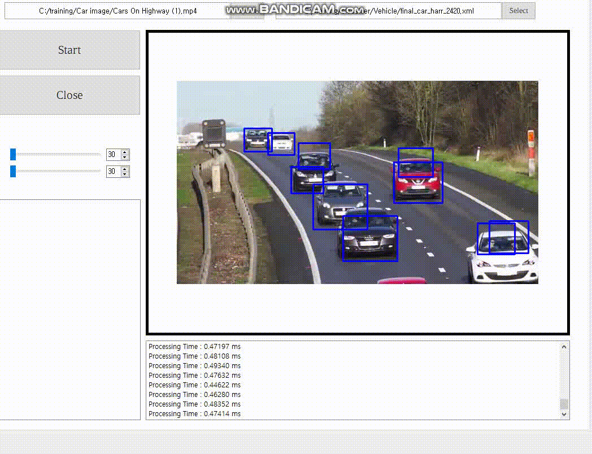

# Object-Detection 👐
Object Detection using Viola-Jones detector

## HashTag 👐:
 - #Visual Studio #C++ #OpenCV #Object Detection #haarcascade #QT

## Face, Human Body, Car detecting by Viola-Jones detector 👐
학습하고 추출된 Xml파일과 GUI을 제작하는데 사용한 QT,CPP 파일 첨부

## Process 😀
**Collect Data, ROI Crop, GUI Programming by QT**

우리는 웹 사이트에서 training을 위해 긍정적이고 부정적인 데이터 셋을 수집했습니다.
그런 다음 작업에 도전하기 위해 몇 장의 사진을 찍었습니다. (얼굴 감지 및 신체 감지의 일부)

먼저 LBP를 사용하여 캐스케이드 분류기를 실행 해 보았습니다. 물체 감지에 대한 정상적인 결과를 얻을 수 있습니다.
그리고 HAAR을 사용하여 캐스케이드 교육을 실행합니다. 20 시간 넘게 많은 시간이 걸리기 때문입니다.

마지막으로 프로그램이 잘 작동하는지 테스트하기 위해 Visual Studio에서 * .xml 소스 파일을 열었습니다.
일부 파일은 좋지만 일부는 좋지 않습니다. 우리는 캐스케이드 훈련의 좋은 결과를 위해 샘플을 수정했습니다.

## Discussion

Opencv에서 오브젝트를 인식하는 대표적인 방법중의 하나는 Haarcascade 라이브러리 모듈을 사용하는 방법이다. Haarcascade 라이브러리를 사용하여 인식할 수 있는 오브젝트는 사람의 정면 얼굴, 얼굴 안의 눈, 고양이 얼굴, 사람의 몸 각 부분들, 컬러 및 차량을 포함한다.

사람의 얼굴을 인식하기위한 Haarcascade 방식의 알고리듬은 머신 러닝의 컨볼류션(convolution neural network) 신경망 분석 기법과 유사하다고 한다. 얼굴을 인식하기 이한 haarvascade_frontalface_default.xml의 예를 들면 수천개의 양화와 음화 이미지를 학습하여 만들어진다.

_아래는 학습된 결과를 이용하여 객체를 탐지하는 프로그램의 일부분이다._

#### GIF

